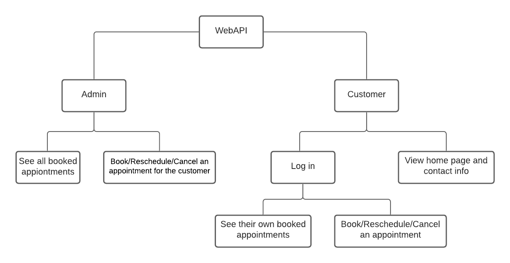

# TDDD27 - TOOTHPASTE
A web application for booking appointments in the course Advanced Web Pogramming at Linköping University.

**Creators**
Malin Rahm (malra146)
Louise Nilsson (louni313)

## Final screencast
https://youtu.be/-vpIrBNQMJU

## Oral screencast
Louise Nilsson, louni313: https://youtu.be/EU4ZNGOUYRE

Malin Rahm, malra146: https://youtu.be/HSG7NpxGmyU

## Mid course screencast
https://youtu.be/BHfg5Io9njk 


## Functional Specification
**Admin**
- The admin user can book, reschedule and cancel an appointment for the customer.
- The admin user can create new available appointments.

**Customer**
- Each logged in customer can login to book and cancel an appointment. 
- The customer can also see his/hers booked appointments.
- All customers can view information about the company and their contact information.


## Technical Specification
We will be using the technology stack, MEVN. 

**Front end:**
Vue.js 

**Server:**
Express.js and Node.js

**Database:**
MongoDB





## Project setup
```
npm install
```

### Compiles and hot-reloads for development
```
npm run serve
```

### Compiles and minifies for production
```
npm run build
```

### Lints and fixes files
```
npm run lint
```

### Customize configuration
See [Configuration Reference](https://cli.vuejs.org/config/).
